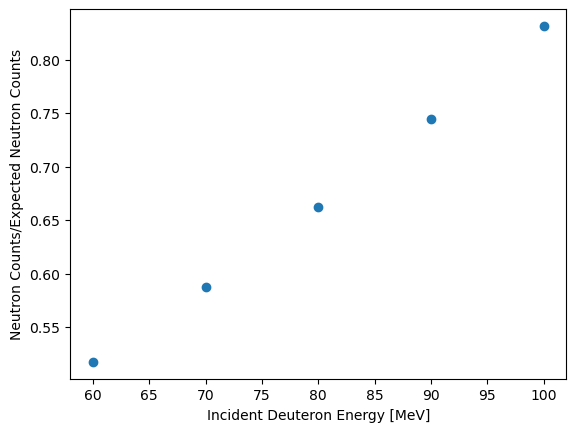

# Geant4_Codes
## dtTest
The dtTest code is meant as a simple platform for modelling DT fusion in a thin target, that was then expanded to modeling a variety of reactions in thin or thick targets. The code is structured similarly to many Geant4 platforms, with a main file in dtTest.cc, and various classes defined in the src and include folders. Of particular interest to some users may be the NeutronProduction.cc and .hh files, as these describe a new physics process implemented to better model low energy light isotope alpha,n reactions. See the section on "New Phyiscs Models" for more details.

### The Basics
Similar to all Geant4 platforms, a primary generator action (PGA), physics list, and geometry or detector construction, are required. However, we don't just want to shoot some deuterons at a target, we want to know what happens, so additional classes are added for extra capabilities. In order to tally events occuring within the tritium target, and extract information from the simulation, we set up steppingAction, eventAction, and runAction classes, as well as an eventAction messenger class for passing information from the command line interface to the code, specifically to actions we take within eventAction. We also introduce a cross-section biasing class (XSBiasing), for increased statistics. This are all defined in seperate classes in dtTest, and we will go through how each is set up one at a time.

#### How To Run:

Compile and build the code using cmake. I usually use vscode's built in build and compile features, but any cmake should work. You just need to have the environment variable $Geant4_DIR set to wherever your geant4 installation is. Mine is set to /usr/local/geant4/geant4/geant4-v11.1.2/lib/Geant4-11.1.2/ There's also some instructions on the Geant webiste about setting up the environment variables. 

Once you've built the code, you can run it from the build directory in visualization mode by running ./dtTest This will open a visualization window, where you can then run the macro "ParticleGun.mac" for an example of multiple run with a variety of beam energies. If you look through the macro, you'll see what the current settings are and the user can set the energy either from the command line, or through the macro. 

When the macro finishes running, it will dump the collected data (energy, direction, and particle type) to a file, specified by /scintTest/output/setFileName There isn't a default in the ParticleGun.mac macro, as I change it somewhat frequently. In the visualization, a Geant generated histogram of neutron energy should also pop up.

In your analysis of the results, be sure to check the cross-section biasing factor, as by default it's set to 1000. Setting it to 1 will use normal cross-sections, but, the code will take a very very long time to run to get a statistically significant result. See the cross-section biasing section for more details. 

## 
## Details on Specific Quirks of the Code
### The Primary Generator Action (PGA)
dtTest uses a General Particle Source (GPS) as the particle source for it's flexibility and ease of use. All parameters, including type of particle, energy, source position, and direction, can be set from the command line, however, only a few, such as particle type and position can be initialized in the code itself. Thus the only default settings for a source in dtTest are 1 deuteron per event, located at (0.,0.,13.) cm. The macro script, "ParticleGun.mac" is provided as well, which gives examples of how to set particle energy, and direction, as well as source size.  

The following lines are used in ParticleGun.mac to set up a 100 keV, 0.2 by 0.2 cm square particle source aimed in the -z direction at our target:
~~~
# 0.2x0.2 cm square plane source
/gps/pos/type Plane
/gps/pos/shape Square
/gps/pos/centre 0. 0. 13. cm
/gps/pos/halfx 0.1 cm
/gps/pos/halfy 0.1 cm

# -z momentum direction 
/gps/direction 0. 0. -1.

# 100 keV energy
/gps/ene/mono 100. keV
~~~

Additional details may be added to the GPS from a macro or the command line, and more information on GPS options can be found on the Geant4 documentation page.

#### The Physics List

The physics list class is used to specify the specific packages we want to use to simulate particle transport. I've chosen the following specific packages for hadronic interactions, as they use the ParticleHP package for low energy (10 eV-20 MeV) interactions:
- HadronElasticPhysicsXS
- HadronInelasticQBBC
- FancyNeutronPhysics

An astute user may note that "FancyNeutronPhysics" is not a Geant4 distributed physics list. This is a list I wrote to implement a one line "on/off" switch for the new physics models for neutron production from low energy light isotope reactions, as discussed in more detail below.

QBBC uses slightly different de-excitation physics from QGSP, and the production list QBBC uses NeutronHP and ParticleHP, and is recommended for thin target and shielding simulations. 

I chose EmLowEPPhysics for the EM Physics package, as it is supposed to be the best package for shielding and low energy physics modelling, but there may be a better option. 

When working with the EM Physics packages, the production cuts in all EM physics packages on the de-excitation physics cause an underproduction of neutrons, even while the correct number of inelastic collisions occur. The production cuts for deuterons are set to 0mm by default in dtTest, which helps a small amount (~15% more neutrons produced), but does not fully fix the problem, and could create other issues if used with thicker targets. The exact percent the model underproduces by varies with deuteron energy, as shown below, so to accurately model neutorn production, a priliminary run must be done to determine the percent error. After this, EM physics can be turned off, or a factor should be introduced in xs biasing the DT reaction to account for the issue. A factor of 1.22 for 100 keV deuterons is suggested. 

Cross-section (xs) biasing is also included in the physics list file. This is implemented in the XS Biasing class, which is mostly taken from the GB01 example in the extended biasing examples, which also has helpful documentation on this. As I understand it, the class wraps specified processes, termed 'Bias processes', for specified particles, and multiplies the process' xs by a value set the user. The wrapped process then updates the cross section and interaction length to the step, and the step takes it from there. The xs biasing in dtTest is setup to only bias hadron inelastic processes, and is only assigned to occur within the tritium volume, so it should only impact DT fusion. Because Geant4 does not discriminate in more detail than "hadron elastic," "hadron inelastic," or "hadron ionizing," in the type of reactions the deuteron can engage in, we cannot bias the process in more detail than that. The specific volume which the biasing occurs in is set in geometryConstruction, and the particle type is set in physics list or the main file.

#### New Physics Models
The new physics models implemented here are found in the "NeutronProduction.cc" and "NeutronProduction.hh" files. Broadly, these files implement a new physics process which calculates angle-energy distributions for neutrons produced from the 13C(alpha,n)16O, 10B(alpha,n)13N, and 11B(alpha,n)14N reactions based on inelastic reaction kinematics, as described in the IBA Handbook 2nd Ed., Appendix 4. To sample the angle at which the particles should be emitted at, the process uses G4RandGenerators generated from tabulated angular distributions for these reactions processed from the JENDL-5 libraries. These tabulated distributions are contained in the header files "B11AngularData.hh," and "C13AngularData.hh" which were produced using code in the "ENDF_2_G4" repo on my main github page. Currently the "NeutronProduction.cc" file is hard coded to switch between the 13C, 10B, and 11B reactions based on heavy isotope Z, and the process will not change the neutron for any other reactions. This is done as I have only validated the model and processed angular data for these three reactions, but if there is interest in expanding this further, please contact me at szangi@mit.edu to discuss broadening of the model. For more detail on implementation see the full commented files.
